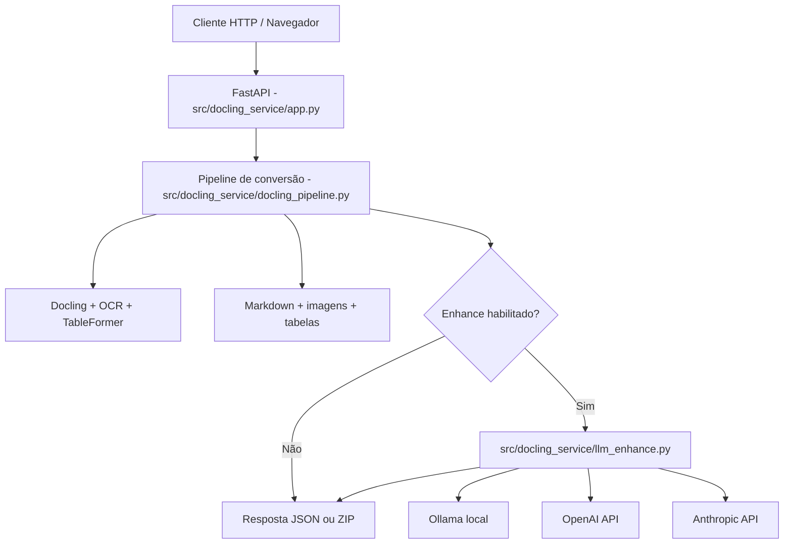

# Arquitetura

## Visão geral

O serviço é uma API HTTP em `FastAPI` que recebe arquivos `PDF` e `DOCX`, processa o conteúdo com `Docling` e devolve `Markdown` ou um arquivo `.zip` contendo o resultado e os assets gerados.

O enhancement por LLM é opcional e pode usar:

- `Ollama` local
- `OpenAI`
- `Anthropic`

## Diagrama

## Componentes

| Componente | Arquivo | Responsabilidade |
|---|---|---|
| API HTTP | `src/docling_service/app.py` | expõe endpoints, recebe uploads e retorna JSON/ZIP |
| Pipeline principal | `src/docling_service/docling_pipeline.py` | orquestra conversão, OCR, tabelas, imagens e fallback `DOCX -> PDF` |
| Enhancement LLM | `src/docling_service/llm_enhance.py` | pós-processa Markdown com texto/visão |
| Containerização | `Dockerfile` / `docker-compose.yml` | empacota o runtime e expõe o serviço |
| Setup local | `pyproject.toml`, `uv.lock`, `requirements.txt` | dependências para desenvolvimento local e build Docker |

## Fluxo de processamento

1. o cliente envia um ou mais arquivos
2. o `FastAPI` grava o upload em diretório temporário
3. o pipeline converte o documento com `Docling`
4. opcionalmente, o resultado é enriquecido por LLM
5. o endpoint `/health` permite verificação simples de disponibilidade
6. o serviço devolve `Markdown` em JSON ou um `.zip`
7. arquivos temporários são removidos ao final da requisição

## Observações operacionais

- A API é **stateless** no fluxo principal; os resultados são gerados em diretórios temporários.
- O caminho Docker é o mais indicado para padronizar GPU, LibreOffice e dependências de OCR.
- O enhancement por LLM pode aumentar latência, custo e consumo de tokens.
